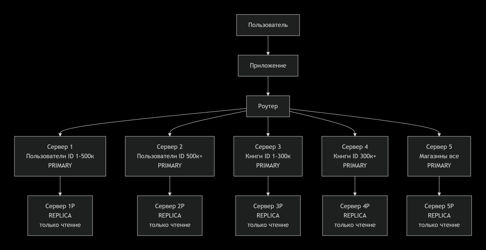

# Домашнее задание к занятию «Репликация и масштабирование. Часть 2»
Выполнил: Береснев Игорь Андреевич

---

## Задание 1. 

Опишите основные преимущества использования масштабирования методами:

активный master-сервер и пассивный репликационный slave-сервер;

master-сервер и несколько slave-серверов;

Дайте ответ в свободной форме.

Активный master + пассивный slave (1+1):

Отказоустойчивость (автоматическое переключение при сбое master)
Резервное копирование без нагрузки на master
Простота настройки и обслуживания

Master + несколько slave (1+N):

Балансировка нагрузки на чтение (запросы распределяются между slave)
Горизонтальное масштабирование read-операций
Высокая доступность (при отказе одного slave остальные работают)
геораспределение (slave в разных регионах для локальных чтений)

## Задание 2.

Разработайте план для выполнения горизонтального и вертикального шаринга базы данных. База данных состоит из трёх таблиц:

пользователи,
книги,
магазины (столбцы произвольно).

Опишите принципы построения системы и их разграничение или разбивку между базами данных.

Пришлите блоксхему, где и что будет располагаться. Опишите, в каких режимах будут работать 

сервера.

### Скриншот Блок схемы

Серверы работают в двух режимах:

Primary (Мастер) — сервер принимает запросы на чтение и запись. В этом режиме работают все пять 
серверов с данными (серверы 1, 2, 3, 4, 5).

Replica (Резервная копия / Только чтение) — каждый главный сервер имеет свою резервную копию. 

Резервный сервер получает данные с главного, отвечает только на запросы чтения. При падении 
главного сервера резервный становится главным.
